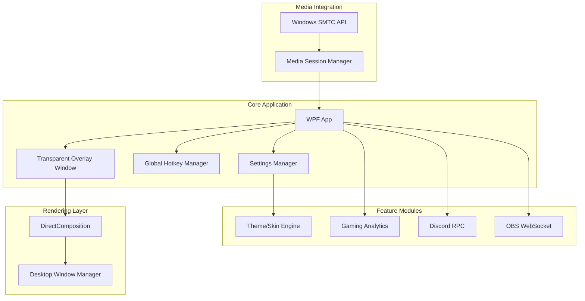

# TunesLayer - Gaming Audio Overlay Development Plan

## Legal Positioning: Why SMTC-Only is the Safe Path

**Critical Decision**: By using Windows Media Session (SMTC) exclusively and NOT the Spotify API, TunesLayer is classified as a **Windows System Media Controller**, not a Spotify Developer Application (SDA).

| Approach | Classification | Monetization Restrictions |

|----------|---------------|---------------------------|

| Spotify API (Streaming SDA) | Spotify Developer App | Cannot sell app, ads prohibited, analytics prohibited |

| Spotify API + BYOK | User's personal SDA | Legal gray area, user assumes responsibility |

| **SMTC Only (Our Choice)** | **System Utility** | **No restrictions - full commercial freedom** |

**What this means for TunesLayer:**

- Premium skins: LEGAL to sell
- Analytics features: LEGAL to monetize (data comes from Windows, not Spotify)
- Discord/OBS integrations: LEGAL to include in paid tiers
- In-app ads: LEGAL if desired
- One-time purchase or subscription: LEGAL

**Trade-offs:**

- No Spotify-specific features (playlists, liked songs, recommendations)
- Album art may be lower resolution (SMTC thumbnail vs API high-res)
- Works with ANY media app (Spotify, Apple Music, YouTube Music, Tidal, etc.)

The universal media support is actually a **market advantage** - TunesLayer serves all music streaming users, not just Spotify subscribers.

## Architecture Overview



## Technology Stack

| Component | Technology | Rationale |

|-----------|------------|-----------|

| Framework | WPF (.NET 8) | Mature, excellent transparency support, hardware acceleration |

| Rendering | DirectComposition | GPU-composited, minimal CPU overhead |

| Media API | Windows.Media.Control (WinRT) | Zero-auth SMTC integration |

| Hotkeys | Win32 RegisterHotKey | Works with exclusive fullscreen games |

| Settings | JSON + SQLite | Lightweight persistence |

| Discord | Discord GameSDK / RPC | Native Rich Presence |

| OBS | obs-websocket-dotnet | WebSocket protocol for widget control |

| UI/Skins | XAML ResourceDictionaries | Hot-swappable themes |

## Phase 1: Core Foundation

### 1.1 Project Setup

- Create WPF solution targeting .NET 8 with Windows-specific TFM
- Configure single-file publish with trimming for small footprint
- Set up project structure:
  ```
  TunesLayer/
  ├── TunesLayer.App/           # Main WPF application
  ├── TunesLayer.Core/          # Business logic, services
  ├── TunesLayer.Overlay/       # Overlay window and rendering
  └── TunesLayer.Integrations/  # Discord, OBS, etc.
  ```


### 1.2 Anti-Cheat Safe Overlay Window

Create an external transparent window using safe Win32 flags:

```csharp
// Window configuration for anti-cheat safety
WindowStyle = WindowStyle.None;
AllowsTransparency = true;
Topmost = true;
ShowInTaskbar = false;

// Win32 extended styles
WS_EX_LAYERED      // Layered window for transparency
WS_EX_TRANSPARENT  // Click-through when not focused
WS_EX_TOOLWINDOW   // Hidden from Alt+Tab
WS_EX_NOACTIVATE   // Never steal focus from game

// Exclude from screen capture (anti-cheat friendly)
SetWindowDisplayAffinity(hwnd, WDA_EXCLUDEFROMCAPTURE);
```

### 1.3 Windows Media Session Integration

Implement SMTC listener for universal media control (works with Spotify, Apple Music, YouTube Music, Tidal, etc.):

```csharp
// WinRT interop for media session - NO Spotify API needed
var sessionManager = await GlobalSystemMediaTransportControlsSessionManager
    .RequestAsync();
var currentSession = sessionManager.GetCurrentSession();

// Subscribe to media property changes
currentSession.MediaPropertiesChanged += OnMediaChanged;
currentSession.PlaybackInfoChanged += OnPlaybackChanged;

// Available data from SMTC (no auth required):
// - Track title, artist, album name
// - Album art thumbnail (from system cache)
// - Playback status (playing/paused)
// - Timeline position and duration
// - Playback controls (play, pause, skip, previous)
```

**Supported Media Sources** (automatically detected):

- Spotify (Desktop & Microsoft Store)
- Apple Music
- YouTube Music (via browser)
- Amazon Music
- Tidal
- Deezer
- Any app that publishes to Windows Media Session

### 1.4 Global Hotkey System

Register system-wide hotkeys that work in exclusive fullscreen:

| Default Hotkey | Action |

|----------------|--------|

| Ctrl+Alt+Space | Play/Pause |

| Ctrl+Alt+Right | Next Track |

| Ctrl+Alt+Left | Previous Track |

| Ctrl+Alt+Up | Volume Up |

| Ctrl+Alt+Down | Volume Down |

| Ctrl+Alt+O | Toggle Overlay |

## Phase 2: User Interface

### 2.1 Minimalist Player Design

- 1:1 aspect ratio widget emphasizing album art
- Controls appear on hover with smooth fade animation
- Draggable positioning with edge-snap
- Resizable with aspect ratio lock
- Semi-transparent background with blur (acrylic effect)

### 2.2 UI Components

- Album art display with reflection effect
- Track title with marquee scroll for long names
- Artist name
- Progress bar (visual only via SMTC timeline)
- Play/Pause, Next, Previous buttons
- Volume slider
- Settings gear icon
- **Source indicator** (small icon showing Spotify/Apple Music/YouTube/etc. - positioned in corner, NOT on album art)

### 2.3 System Tray Integration

- Minimize to tray on close
- Right-click context menu for quick controls
- Double-click to show/hide overlay
- Balloon notifications for track changes (optional)

## Phase 3: Theme and Skin Engine

### 3.1 Theme Architecture

- XAML ResourceDictionary-based theming
- JSON manifest for theme metadata
- Support for custom accent colors, fonts, opacity
- Theme preview in settings

### 3.2 Built-in Themes

| Theme | Description |

|-------|-------------|

| Midnight | Dark with purple accents (default) |

| Neon | Cyberpunk aesthetic with glow effects |

| Minimal | Clean white/black, no decorations |

| Glassmorphism | Frosted glass with blur |

| Retro | Pixel art inspired |

### 3.3 Premium Skin System

- Theme pack format (.tuneslayer-theme)
- In-app theme browser
- Import/export functionality
- Future: marketplace integration

## Phase 4: Gaming Analytics

**Legal Note**: These analytics are derived from Windows system-level data (SMTC + active window), NOT from Spotify's API. This is permitted because we're analyzing the user's own system activity, not "Spotify Content."

### 4.1 Session Tracking

- Track listening time per gaming session
- Most played tracks/artists while gaming (from SMTC metadata)
- Correlate music with game detection (via active window title)
- Generate weekly/monthly listening reports
- All data stored locally - user owns their data

### 4.2 Data Visualization

- Charts for listening patterns
- Heat map of play times by hour/day
- Game-music correlation insights ("You played 80% aggressive music during Valorant")
- Export to JSON/CSV

## Phase 5: Discord Integration

### 5.1 Rich Presence

- Display current track in Discord status
- Show album art as large image
- Include "Listening while playing [Game]" context
- Toggle on/off per user preference

### 5.2 Implementation

```csharp
// Discord RPC setup
var discord = new DiscordRpcClient("APP_ID");
discord.SetPresence(new RichPresence {
    Details = trackTitle,
    State = $"by {artist}",
    Assets = new Assets {
        LargeImageKey = albumArtUrl,
        LargeImageText = albumName
    }
});
```

## Phase 6: OBS/Streaming Integration

### 6.1 Now Playing Widget

- Local HTTP server serving "Now Playing" HTML widget
- Customizable CSS themes for streamers
- Real-time WebSocket updates
- Browser source URL for OBS

### 6.2 Widget Features

- Animated track transitions
- Album art with configurable size
- Progress bar option
- Transparent background support

## Phase 7: Settings and Configuration

### 7.1 Settings Categories

- **General**: Startup behavior, language, update preferences
- **Overlay**: Position, size, opacity, click-through toggle
- **Hotkeys**: Customizable key bindings
- **Appearance**: Theme selection, custom colors
- **Integrations**: Discord, OBS configuration
- **Analytics**: Data retention, privacy options

### 7.2 Configuration Storage

- `%AppData%\TunesLayer\settings.json` for preferences
- SQLite database for analytics data
- Portable mode option (store in app directory)

## File Structure

```
TunesLayer/
├── src/
│   ├── TunesLayer.App/
│   │   ├── App.xaml
│   │   ├── Views/
│   │   │   ├── MainWindow.xaml         # Settings/main UI
│   │   │   ├── OverlayWindow.xaml      # Transparent overlay
│   │   │   └── SettingsView.xaml
│   │   └── ViewModels/
│   ├── TunesLayer.Core/
│   │   ├── Services/
│   │   │   ├── MediaSessionService.cs  # SMTC integration
│   │   │   ├── HotkeyService.cs        # Global hotkeys
│   │   │   ├── SettingsService.cs
│   │   │   └── AnalyticsService.cs
│   │   └── Models/
│   ├── TunesLayer.Overlay/
│   │   ├── OverlayManager.cs           # Window positioning
│   │   ├── RenderingEngine.cs          # DirectComposition
│   │   └── ClickThroughHelper.cs       # Win32 interop
│   └── TunesLayer.Integrations/
│       ├── Discord/
│       └── OBS/
├── themes/
│   ├── Midnight.xaml
│   ├── Neon.xaml
│   └── Minimal.xaml
├── assets/
│   └── icons/
├── TunesLayer.sln
└── README.md
```

## Performance Targets

| Metric | Target |

|--------|--------|

| Memory footprint | < 50 MB |

| CPU usage (idle) | < 0.1% |

| CPU usage (active) | < 1% |

| GPU impact | < 0.5% |

| Startup time | < 2 seconds |

| Frame latency added | < 0.1 ms |

## Branding and Marketing Strategy

### Trademark Safety

- App name: **TunesLayer** (no "Spotify" in title to avoid Microsoft Store trademark rejection)
- Tagline options: "Gaming Music Overlay" or "Media Controller for Gamers"
- Never use "Spotify" as a product descriptor - only as "works with Spotify"

### Source Attribution UI

Display the media source icon to indicate where music is playing from:

```
┌─────────────────────────┐
│ [Album Art]             │
│                         │
│ Track Title             │
│ Artist Name             │
│ ▶ ◀◀ ▶▶               │
│              [🎵 icon]  │  ← Small source icon (Spotify/Apple/etc.)
└─────────────────────────┘
```

**Rules:**

- Show source app icon in corner (NOT on album art)
- Use official brand colors for source indicator
- Never imply TunesLayer IS Spotify

### Key Marketing Messages

| Message | Target Audience |

|---------|-----------------|

| **"Zero Login Required"** | Privacy-conscious users tired of OAuth flows |

| **"Works in 2 Seconds"** | Casual gamers who hate configuration |

| **"No Account Needed"** | Users wary of third-party app permissions |

| **"Performance-First"** | Competitive gamers (vs. laggy Game Bar) |

| **"Anti-Cheat Safe"** | Players worried about bans |

| **"Works with Any Music App"** | Users of Apple Music, YouTube, Tidal |

### Competitive Positioning

```
              ┌─────────────────────────────────────────┐
              │           SETUP COMPLEXITY              │
              │    Simple ◄─────────────────► Complex   │
              │                                         │
     Light    │  ★ TunesLayer    Windows Game Bar      │
       ▲      │                                         │
       │      │                        Overwolf/Musme   │
  RESOURCE    │                                         │
   USAGE      │                                         │
       │      │                              Lofi       │
       ▼      │  Tuneful (Mac)              Spotube    │
     Heavy    │                                         │
              └─────────────────────────────────────────┘
```

TunesLayer occupies the "Simple + Lightweight" quadrant - the ideal position for the target "Simple User" demographic.

## Monetization Strategy (Legally Safe)

Since TunesLayer uses SMTC only (no Spotify API), all monetization options are available:

| Tier | Price | Features |

|------|-------|----------|

| Free | $0 | Basic overlay, 2 themes, global hotkeys, system tray |

| Pro | $9.99 (one-time) | All themes, analytics dashboard, Discord RPC, OBS widget |

| Pro+ | $14.99 (one-time) | Pro + custom theme creator, priority support |

**Alternative Models:**

- Microsoft Store purchase (handles payment, 15% cut)
- Gumroad / Paddle for direct sales
- Patreon for early access + custom themes

## Implementation Order

The project will be built incrementally, with each phase producing a working application:

1. **Phase 1**: Transparent overlay + SMTC + hotkeys = functional MVP
2. **Phase 2**: Polished UI = release-ready basic version
3. **Phase 3**: Themes = monetization foundation
4. **Phase 4**: Analytics = user engagement features
5. **Phase 5**: Discord = social features
6. **Phase 6**: OBS = streamer market expansion
7. **Phase 7**: Settings polish = production ready